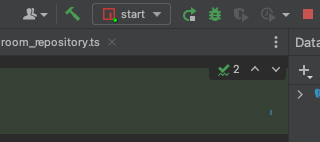
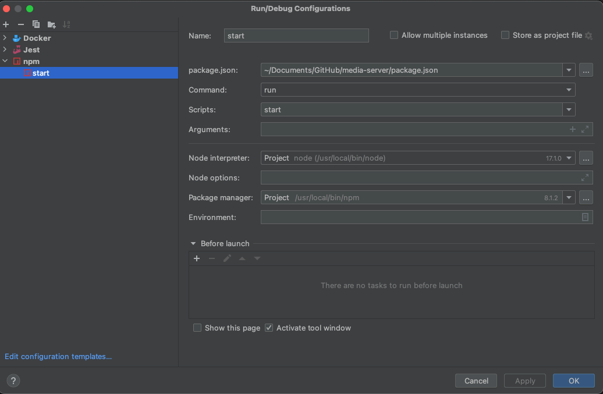

# camstudy_web

# 로컬에서 구동 방법

## 1. 환경변수 설정

프로젝트 루트에 `.env` 파일을 생성하여 아래와 같이 환경 변수들을 설정한다.

```text
NEXT_PUBLIC_BASE_URL = "http://localhost:3000"
NEXT_PUBLIC_MEDIA_SERVER_BASE_URL = "http://localhost:2000/room"
```

## 2. NodeJS 설치

- NodeJS: 17.1.0

위 버전에 맞게 설치 진행

## 3. 의존성 설치

```console
npm install
```

## 4. 실행

**콘솔로 실행하는 법**

프로젝트 루트로 디렉토리 이동 후 아래의 커맨드 입력

```console
npm run dev
```

**인텔리제이 Run Configuration을 추가하여 실행하는 법**





1. 첫 번째 이미지의 `start` 텍스트(설정 전에는 다른 텍스트일것임)가 있는 버튼을 누르고 `Edit Configuration..` 버튼 클릭
2. 두 번째 이미지의 좌측 상단 `+` 버튼을 눌러 `npm` 추가
3. `command`, `script`에 run, dev 입력

## 5. 크롬으로 공부방 접속

- [미디어 서버](https://github.com/hansung-ez-care/media-server)를 마찬가지로 실행
- 아래의 주소를 주소창에 입력

http://localhost:3000/rooms/1234

(참고: `http://localhost:3000/rooms/{roomId}` 형식임)

- 우측 상단의 "입장" 버튼을 눌러 공부방 입장
- 다른 탭을 실행하여 동일한 공부방에 접속하여 비디오 전송 확인 가능 

# Prisma DB 업데이트 방법

```console
prisma db pull
prisma generate
```
